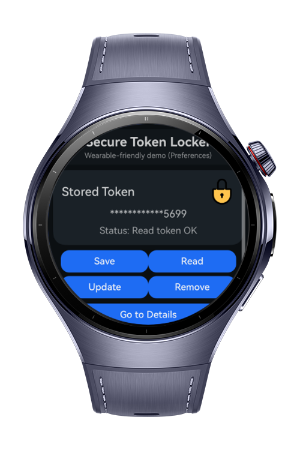
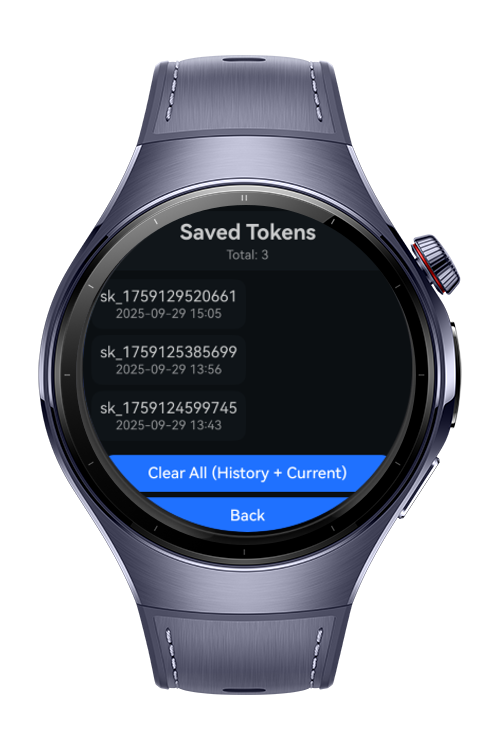

> **Note:** To access all shared projects, get information about environment setup, and view other guides, please visit [Explore-In-HMOS-Wearable Index](https://github.com/Explore-In-HMOS-Wearable/hmos-index).

# SecureTokenLocker

SecureTokenLocker is a wearable sample app that securely **saves, reads, updates, and removes** token values and shows a compact **history list** of all actions for quick auditing on small screens.


<div>
  
  
  
  
</div>

# Use Cases

. Users land on the main screen and access **Save / Read / Update / Remove** actions.
2. **Save** a token (key/value) → success banner + an entry in **History**.
3. **Read** a token by key → value (or error) is displayed and logged.
4. **Update** an existing token → new value replaces the old one; history updated.
5. **Remove** a token by key → deletion result is reflected in history.
6. Users can navigate between **Home**, **Tokens**, and **Details** pages for a compact wearable experience.

# Tech Stack

- **Languages**: ArkTS, ArkUI
- **Frameworks**: HarmonyOS 5.1.0(18)
- **Tools**: DevEco Studio Vers 5.1.0.828SP1
- **Libraries**: `@kit.ArkUI` (plus platform Security/Storage APIs)

# Required Permissions

- _No runtime permissions required._
  > Token operations rely on platform security/storage APIs and do not require location or network permissions.

# Directory Structure

```
entry/src/main/ets/
├─ components/
│ ├─ ActionGrid.ets
│ └─ TokenCard.ets
│
├─ entryability/
│ └─ EntryAbility.ets
│
├─ entrybackupability/
│ └─ EntryBackupAbility.ets
│
├─ pages/
│ ├─ DetailsPage.ets
│ ├─ HomePage.ets
│ ├─ Index.ets
│ └─ TokensPage.ets
│
├─ services/
│ ├─ assetService.ets
│ ├─ cloudInit.ets
│ └─ prefsService.ets
│
├─ types/
│ ├─ LiteError.ets
│ ├─ RouterParams.ets
│ └─ TokenItem.ets
│
└─ resources/ # images, strings, layouts, etc.
```
# Constraints and Restrictions

## Supported Devices

- Huawei Watch 5 (and HarmonyOS wearable devices with compatible Security/Storage capabilities)

## Limitations

- The app targets **wearable** devices; certain secure storage APIs may not function in previewer/simulators.
- Ensure the device profile and **SysCap** are correctly configured for wearable targets.

# License
**SecureTokenLocker** is distributed under the terms of the MIT License.  
See the [LICENSE](LICENSE) for more information.

